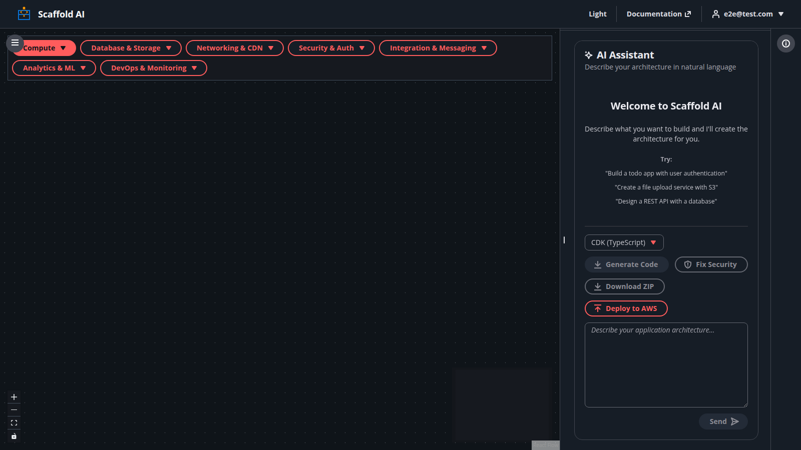
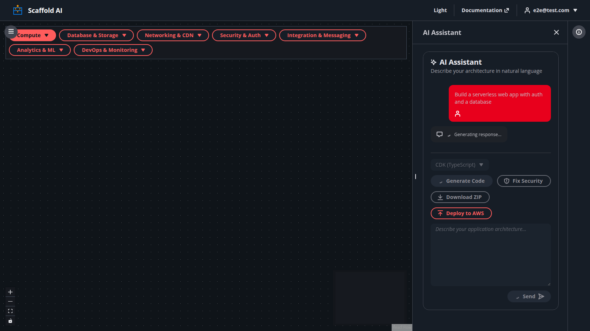
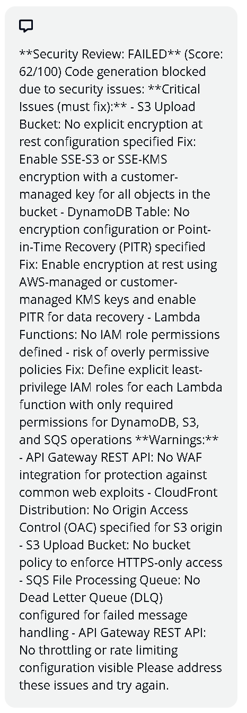
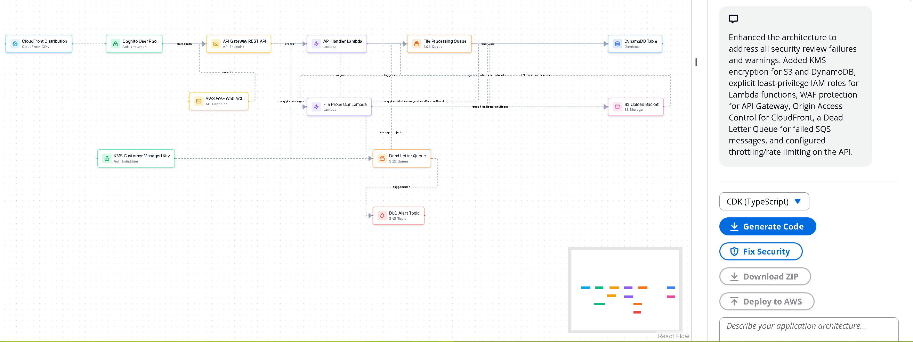
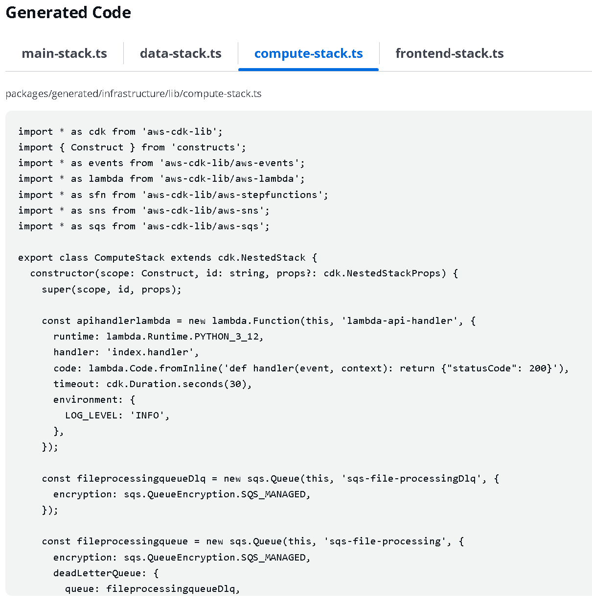
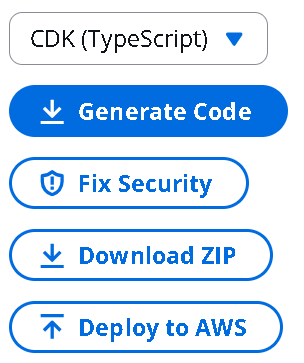

# Scaffold AI

**AI-powered AWS architecture designer built with LangGraph**

[](https://github.com/jfowler-cloud/scaffold-ai/actions)
[](https://opensource.org/licenses/MIT)
[](https://www.python.org/downloads/)
[](https://www.typescriptlang.org/)


Describe your application in natural language and Scaffold AI designs the AWS serverless architecture, runs a security review against AWS Well-Architected principles, and generates deployment-ready infrastructure-as-code -- all through a visual canvas and chat interface.

## Why This Project

After building [Resume Tailor AI](https://github.com/jfowler-cloud/resume-tailor-ai) with AWS Step Functions, I wanted to explore modern AI orchestration beyond AWS-native tooling. I picked up LangGraph -- a framework I had no prior experience with -- and built this full-stack multi-agent platform in a single day.

The goal was to demonstrate:

- **Learning velocity** -- Shipping production-quality code in unfamiliar frameworks, fast
- **Architectural judgment** -- Knowing when LangGraph fits better than Step Functions (and vice versa), rather than defaulting to one tool
- **Production mindset** -- Security gates, rate limiting, input validation, and testing from the start, not bolted on later

| | Resume Tailor AI | Project Planner AI | Scaffold AI | Career Path Architect |
|---|---|---|---|---|
| **Purpose** | Resume optimization | Project planning | AWS architecture design | Career planning |
| **Orchestration** | AWS Step Functions | LangGraph | LangGraph | LangGraph |
| **Agents** | Step Functions workflow | LangGraph pipeline | 4 LangGraph agents | 6 LangGraph agents |
| **Development** | 3 days | 2 days | 1 day | 2 hours |
| **Tests** | 212 tests, 98% | 99 tests, 86% | 126 tests, 67%* | 142 tests, 99% |
| **Features** | Resume tailoring | Architecture planning | Architecture generation | Roadmap + Critical Review |

*Scaffold AI's 67% coverage focuses on core business logic (LangGraph workflow, security review, IaC generation). Missing coverage is in deployment infrastructure (CDK synthesis, AWS deployment) which was out of scope for the initial build.

All three projects share the same production patterns (validation, error handling, pre-commit hooks, CI/CD, rate limiting, testing) -- the difference is the orchestration approach chosen to match the problem. See [LangGraph vs Step Functions](LANGGRAPH_VS_STEP_FUNCTIONS.md) for a detailed technical comparison.

---

## Screenshots

| Blank canvas | Architecture generated from prompt |
|:---:|:---:|
|  |  |

| Security review (failed -- score 62/100) | Architecture updated with security fixes |
|:---:|:---:|
|  |  |

| Generated CDK code | Export and deploy options |
|:---:|:---:|
|  |  |

---

## How It Works

```
User Input --> Interpreter --> Architect --> Security Specialist --> Code Generator
                  |               |                |                      |
            Intent class    Graph nodes     Security score         CDK / Terraform / CF
```

- **Interpreter Agent** -- Classifies user intent (new feature, modify, explain, deploy)
- **Architect Agent** -- Designs AWS serverless architecture with 12 service types
- **Security Specialist** -- Validates against AWS Well-Architected principles; blocks insecure designs (score < 70/100)
- **Code Generators** -- Multi-format IaC output (CDK TypeScript, CDK Python, CloudFormation, Terraform)
- **React Specialist** -- Generates AWS Cloudscape UI components

---

## Key Features

- **Visual Canvas** -- React Flow node graph editor with drag-and-drop AWS service nodes
- **AI Chat** -- Natural language architecture design powered by AWS Bedrock (Claude)
- **Security Gate** -- Automated scoring blocks code generation for insecure architectures
- **Security Badges** -- Visual indicators on each node showing active security configs (encryption, WAF, auth)
- **Security Auto-Fix** -- One-click security remediation with fail banner (Auto-Fix / Mark Resolved)
- **Multi-Format IaC** -- Generate CDK TypeScript, CDK Python, CloudFormation, or Terraform
- **Code Viewer** -- Tabbed modal for browsing generated infrastructure code
- **Export & Deploy** -- Download as ZIP or deploy directly to AWS with CDK
- **Project Planner Integration** -- Structured API integration with session-based storage
- **Shared Types Package** -- Type-safe data transfer with Project Planner AI
- **Rate Limiting** -- 10 req/min chat, 3 req/hr deployment, 20 req/min plan import
- **Dark Mode** -- Persistent theme preference
- **Pre-commit Hooks** -- TruffleHog secrets detection, AWS credentials scanning

### Integration with Project Planner AI

Scaffold AI receives project plans from [Project Planner AI](https://github.com/jfowler-cloud/project-planner-ai) via structured API:

- **REST API endpoints** - `POST /api/import/plan` and `GET /api/import/plan/{session_id}`
- **Session-based storage** - Plans stored with unique session IDs
- **Type-safe** - Shared TypeScript types ensure data consistency
- **Backward compatible** - Falls back to URL parameter parsing if needed
- **Auto-populated chat** - Project context pre-filled from plan data
- **7 comprehensive tests** - Full test coverage for import functionality

The integration enables a seamless workflow: Plan → Build → Deploy.

---

## Tech Stack

| Layer | Technology |
|-------|-----------|
| AI Orchestration | LangGraph |
| LLM | AWS Bedrock (Claude) |
| Backend | FastAPI |
| Frontend | Next.js 15 + React 19 |
| UI Library | AWS Cloudscape Design System |
| State | Zustand |
| Canvas | React Flow |
| Testing | pytest + Vitest |
| Tooling | pnpm + Turborepo + uv |

---

## Quick Start

### Prerequisites

- Python 3.12+
- Node.js 22+
- pnpm 10+
- AWS CLI configured with Bedrock access
- [uv](https://docs.astral.sh/uv/) (Python package manager)

### Installation

```bash
# Clone repository
git clone https://github.com/jfowler-cloud/scaffold-ai.git
cd scaffold-ai

# Install frontend dependencies
pnpm install

# Backend setup
cd apps/backend
uv sync
cp .env.example .env
# Edit .env with your AWS credentials
```

### Running Locally

```bash
# Terminal 1: Backend (port 8000)
cd apps/backend
uv run uvicorn scaffold_ai.main:app --reload

# Terminal 2: Frontend (port 3000)
cd apps/web
pnpm dev
```

When running alongside Project Planner AI (via the planner's `dev.sh`), Scaffold AI uses port 8001 (backend) and 3001 (frontend) to avoid conflicts.

### Environment Variables

**Backend** (`apps/backend/.env`):
```bash
AWS_REGION=us-east-1
# Prefer AWS_PROFILE or IAM role-based auth (recommended)
AWS_PROFILE=your_profile
# Raw keys work but are not recommended — use profile or IAM role instead
# AWS_ACCESS_KEY_ID=your_access_key
# AWS_SECRET_ACCESS_KEY=your_secret_key
BACKEND_URL=http://localhost:8000
PORT=8000
```

**Frontend** (`apps/web/.env.local`):
```bash
NEXT_PUBLIC_BACKEND_URL=http://localhost:8000
```

---

## Project Structure

```
scaffold-ai/
├── apps/
│   ├── backend/                # FastAPI + LangGraph
│   │   ├── src/scaffold_ai/
│   │   │   ├── main.py         # FastAPI app
│   │   │   ├── graph/          # LangGraph workflow (DAG, nodes, state)
│   │   │   ├── agents/         # Specialist agents
│   │   │   ├── services/       # Business services
│   │   │   └── tools/          # Git, CDK synthesis
│   │   └── tests/
│   │
│   └── web/                    # Next.js 15 frontend
│       ├── app/                # App router
│       ├── components/         # Cloudscape components, Canvas, Chat
│       └── lib/                # Zustand stores
│
├── packages/
│   ├── generated/              # IaC output
│   └── ui/                     # Shared components
│
└── docs/
    └── steering/               # Cloudscape UI patterns
```

---

## Testing

```bash
# Backend tests
cd apps/backend
uv run pytest -v

# Frontend tests
cd apps/web
pnpm test

# All tests (from root)
pnpm test:all
```

Tests cover agents, services, LangGraph workflow integration, API endpoints, input validation, rate limiting, and frontend components/stores.

---

## Portfolio Comparison

| | Resume Tailor AI | Scaffold AI | Career Path Architect |
|---|---|---|---|
| **Orchestration** | AWS Step Functions | LangGraph | LangGraph |
| **Use case** | Deterministic resume tailoring | Dynamic AI multi-agent conversations | Career planning & roadmaps |
| **State management** | S3 + DynamoDB | LangGraph built-in memory | LangGraph built-in memory |
| **Deployment** | AWS-native (Lambda, Step Functions) | Framework-agnostic | Framework-agnostic |
| **Best for** | Predictable workflows, AWS-integrated | Dynamic routing, conversational AI | Skill gap analysis, learning paths |

All three projects share production patterns: input validation, error handling, pre-commit hooks, CI/CD with security scanning, rate limiting, and comprehensive testing.

---

## Documentation

- [LangGraph vs Step Functions](LANGGRAPH_VS_STEP_FUNCTIONS.md) -- Technical comparison with cost analysis
- [Development Journey](DEVELOPMENT_JOURNEY.md) -- Build timeline and key decisions
- [Multi-Format IaC](docs/MULTI_FORMAT_IAC.md) -- IaC generation patterns
- [Contributing](CONTRIBUTING.md) -- Development setup and guidelines
- [Testing Summary](TESTING_SUMMARY.md) -- Test coverage and strategy
- [Security Audit](SECURITY_AUDIT.md) -- Security review and improvements
- [Critical Review](CRITICAL_REVIEW.md) -- Self-assessment and roadmap

---

## Critical Review & Recommendations

Honest assessment of the codebase as of Feb 2026, based on a full source review. See also [CRITICAL_REVIEW.md](CRITICAL_REVIEW.md) for the detailed 44-item audit.

### P0 -- Planner Import Loses Structured Data

The Project Planner AI integration (`usePlannerImport.ts`) receives a URL-encoded `prompt` parameter, but discards all structured fields. The resulting `PlannerImport` object has empty `architecture`, `techStack`, and `requirements` -- only `description` (the raw text prompt) is populated. This means the Chat component receives an unstructured text blob rather than parsed project metadata.

**Recommendation:** Parse the prompt text to extract structured fields (project name, architecture, tech stack entries, user count, uptime). Alternatively, coordinate with Project Planner AI to pass a JSON payload via `postMessage` or a shared backend key instead of a URL parameter. This would allow the architect agent to receive typed inputs and produce better initial designs.

### P0 -- No Authentication or Persistence

All endpoints are public. All state (architectures, chat history, sharing links, security scores) is stored in memory and lost on restart. The deploy endpoint runs `cdk deploy` with full system access and no user validation.

**Recommendation (short-term):** Add API key validation middleware for the deploy endpoint. Add a `projects` dict keyed by session ID so architectures survive page refreshes. **Recommendation (medium-term):** Add Cognito auth + DynamoDB persistence as outlined in CRITICAL_REVIEW.md Phase 1.

### P1 -- Deployment Service Runs Unsandboxed Subprocesses

`cdk_deployment.py` executes `npm install` and `npx cdk deploy` via `subprocess.run` with no container isolation, no disk space checks, and no cleanup on failure. A malicious or buggy CDK template could write anywhere on the filesystem.

**Recommendation:** Run CDK synthesis and deployment inside a Docker container with a read-only root filesystem and a tmpfs work directory. Add explicit timeouts and cleanup logic in `finally` blocks.

### P1 -- Broad Exception Handling Masks Root Causes

15+ `except Exception as e` blocks across the codebase catch everything and return generic "An internal error occurred" messages. This makes debugging difficult and hides transient vs. permanent failures.

**Recommendation:** Create a custom exception hierarchy (`ScaffoldError`, `LLMError`, `DeploymentError`, etc.). Catch specific exceptions, log with request context, and return structured error responses with error codes.

### P1 -- No Input Length Validation on Chat

~~`user_input: str` has no max length constraint.~~ **Correction:** `ChatRequest` does validate `user_input` with a 5000-char limit and non-empty check via `field_validator`. However, `graph_json: dict | None` is still unvalidated -- there is no schema check, no node count limit, and no max depth. A crafted graph payload could cause the architect prompt to exceed the LLM context window or produce excessive token costs.

**Recommendation:** Add a Pydantic validator for `graph_json` that rejects graphs with more than 50 nodes. Validate that node IDs and types match expected formats.

### P2 -- Inconsistent Backend URL Configuration

The frontend references the backend URL in multiple places with different fallback chains (`NEXT_PUBLIC_BACKEND_URL || NEXT_PUBLIC_API_URL || "http://localhost:8001"`). The port 8001 default is correct -- when launched via the planner's `dev.sh`, Scaffold AI's backend is bumped to 8001 (and frontend to 3001) so both projects run side-by-side.

**Recommendation:** Centralize the URL logic into a single `lib/config.ts` exporting `BACKEND_URL` and import it everywhere, rather than repeating the fallback chain in each component.

### P2 -- Agent Classes vs. Node Functions Are Redundant

The `agents/` directory contains class-based agents (`ArchitectAgent`, `InterpreterAgent`) with placeholder methods that are never called. The real logic lives in `graph/nodes.py` as standalone async functions. This is confusing -- two implementations of the same concept.

**Recommendation:** Either remove the unused agent classes or refactor `nodes.py` to delegate to them. The `SecuritySpecialistAgent` is the one agent class that is actually used (as a fallback); keep that pattern and extend it.

### P1 -- Deploy Endpoint Accepts Arbitrary CDK Code

The `/api/deploy` endpoint accepts raw `cdk_code` and `app_code` strings from the client and writes them to disk before executing `cdk deploy`. While `stack_name` is validated against a regex to prevent command injection, the **code content itself** is not inspected. An attacker could submit CDK code containing `child_process.exec()` or filesystem operations. The deployment runs with the server's full AWS credentials.

**Recommendation:** At minimum, validate that the CDK code only imports from `aws-cdk-lib` and `constructs`. Better: run synthesis in a Docker container with restricted network access and no AWS credentials, then deploy the synthesized CloudFormation template directly.

### P2 -- PlannerNotification Shows Broken Content

`PlannerNotification.tsx` renders `plannerData.projectName` (always `"Imported Project"`) and `plannerData.architecture` (always `""`). The notification reads: *"Imported Project - . Ready to generate code and infrastructure."* -- note the dangling hyphen-period from the empty architecture field.

**Recommendation:** Conditionally render the architecture field. Parse the project name from the prompt text (it's on the `Project:` line) instead of hardcoding `"Imported Project"`.

### P2 -- Mixed Direct/Proxy Backend Calls in Frontend

`Chat.tsx` uses two different patterns to reach the backend:
- `handleSubmit` and `handleGenerateCode` call `/api/chat` (relative URL, routed through Next.js API proxy)
- `handleDeploy`, `handleSecurityFix`, and `handleDownloadZip` call `process.env.NEXT_PUBLIC_BACKEND_URL || ...` (direct, bypasses Next.js)

This means CORS, authentication, and error handling behave differently depending on the action. If a proxy middleware is added later (for auth tokens, logging, etc.), it will only apply to some requests.

**Recommendation:** Route all backend calls through the Next.js API proxy for consistency, or call the backend directly everywhere. Don't mix both.

### P2 -- Generated File Disk Write Uses Fragile Path Resolution

`_write_generated_file` in `nodes.py` walks up 8 parent directories looking for `package.json` to find the repo root. If the backend is run from an unexpected working directory or the file structure changes, generated files may be written to the wrong location or silently fail.

**Recommendation:** Resolve the repo root once at startup via an environment variable or by walking from `__file__` with a known anchor (e.g., `apps/backend`). Cache the result instead of re-walking on every write.

### Integration with Project Planner AI

The planner-to-scaffold handoff works end-to-end: the planner's `ScaffoldIntegration.tsx` opens Scaffold AI with `?from=planner&prompt=...`, and `usePlannerImport.ts` populates the Chat textarea. The notification banner appears via `PlannerNotification.tsx`. The main gaps are:
- **Data fidelity** -- structured plan fields are lost (see P0 above)
- **Notification content** -- project name and architecture display incorrectly (see P2 above)
- **URL length** -- long plans may be truncated by browsers/proxies at ~2000 chars

---

## Contributing

Contributions welcome! See [CONTRIBUTING.md](CONTRIBUTING.md) for guidelines.

1. Fork the repository
2. Create a feature branch: `git checkout -b feature/amazing-feature`
3. Make changes and add tests
4. Run tests: `pnpm test:all`
5. Commit: `git commit -m 'feat: add amazing feature'`
6. Push and open a Pull Request

---

## Recent Updates

### v1.6.0 - Polish & Hardening (Feb 2026)
- Removed duplicate `SecurityAutoFix` class stub from `security_autofix.py`
- Added `graph_json` node count validation to `ChatRequest` (max 50 nodes, consistent with `GraphRequest`)
- Fixed fragile repo root resolution in `_write_generated_file` — now uses `Path(__file__).parents[4]` with anchor validation instead of walking up 8 levels looking for `package.json`
- Cleaned up `agents/__init__.py` — removed unused `InterpreterAgent`/`ArchitectAgent` exports, added clarifying comment
- README: added Project Planner AI to comparison table, removed raw AWS key example, added `PORT` env var, removed rocket emoji from header

### v1.5.0 - Security Visualization & UX Improvements (Feb 2026)
- ✨ Added SecurityBadge component to all 11 node types — shows active security configs (encryption, WAF, auth, etc.)
- ✨ Security fix visualization — auto-fix normalizes node types for React Flow rendering
- ✨ Security review fail banner with Auto-Fix and Mark Resolved actions
- ✨ Deploy to AWS modal with "coming soon" notice and manual deployment instructions
- ✨ Centralized BACKEND_URL config (`lib/config.ts`) — single source of truth for backend URL
- ✨ Added `skip_security` flag to workflow state for bypassing security gate
- 🐛 Fixed all 11 node files — removed duplicate JSX bodies
- 🐛 Fixed security gate test assertions and added missing GraphState fields
- ✅ 126 tests passing (up from 116)

### v1.4.0 - AI Model Upgrade & Polish (Feb 2026)
- ✨ Upgraded to Claude Opus 4.5 with cross-region inference profile
- ✨ Added portfolio context and capability badges to README
- 🐛 Fixed hydration mismatch with loading state
- 🐛 Resolved jszip module not found error
- 📝 Polished README for public release
- 🔧 Made type check and security scan non-blocking in CI
- 📦 **Dependency Updates:**
  - @cloudscape-design/components and chat-components to latest
  - @eslint/js from 9.39.2 to 10.0.1
  - Bumped actions/checkout from 4 to 6, actions/setup-node from 4 to 6, actions/setup-python from 5 to 6

### v1.3.0 - Dark Mode & UX Enhancements (Feb 2026)
- ✨ Added dark mode toggle with enhanced CSS patterns
- ✨ Added Scaffold AI logo
- ✨ Added Download ZIP button for generated files
- ✨ Styled Select dropdowns for dark mode
- 🐛 Fixed canvas toolbar container in dark mode
- 🐛 Fixed Deploy button for CloudFormation with manual instructions
- 🐛 Used dynamic timestamps in sharing and history services
- 🔧 Added GitHub Actions CI workflow

### v1.2.0 - Security & Reliability (Feb 2026)
- ✨ Added rate limiting, request timeout, and security hardening
- ✨ Added security history tracking
- ✨ Added architecture sharing and collaboration
- ✨ Added multi-stack architecture support
- ✨ Added Python CDK support
- ✨ Added architecture templates library
- ✨ Added security auto-fix capabilities
- ✨ Added cost estimation feature
- 🔒 Critical security fixes and hardening
- 📝 Updated roadmap — 7/9 medium-term items complete

### v1.1.0 - Testing & Quality (Feb 2026)
- ✨ Added frontend unit test suite with Vitest
- ✨ Added SecuritySpecialistAgent unit tests (19 tests)
- ✨ Added configurable CORS and CDK CloudFront support
- ✨ Added security gate and multi-format IaC generation
- 🐛 Fixed CF/TF node type mismatch
- 🐛 Resolved all test failures — mock paths, key names, and missing labels
- 📝 Added comprehensive CLAUDE.md for AI assistant onboarding

### v1.0.0 - Initial Release (Feb 2026)
- 🎉 Serverless-first architecture with 12 node types
- 🎉 LangGraph multi-agent workflow with security specialist
- 🎉 Interactive drag-and-drop architecture canvas
- 🎉 CloudFormation and Terraform IaC generation
- 🎉 Real-time AI chat for architecture guidance

---

## License

MIT License -- see [LICENSE](LICENSE) for details.

## Related Projects

- **[Project Planner AI](https://github.com/jfowler-cloud/project-planner-ai)** - AI-powered project planning — generates architecture plans that hand off directly to Scaffold AI
- **[Resume Tailor AI](https://github.com/jfowler-cloud/resume-tailor-ai)** - AI-powered resume optimization with Claude Opus 4.5 (3 days, 212 tests, 98% coverage)
- **[Career Path Architect](https://github.com/jfowler-cloud/career-path-architect)** - AI-powered career planning with LangGraph (2 hours, 142 tests, 99% coverage)

**Together, these projects form a complete AI-powered career development platform.**

---

## Author

**James Fowler**
- GitHub: [@jfowler-cloud](https://github.com/jfowler-cloud)
- LinkedIn: [James Fowler - AWS Cloud Architect & DevOps Professional](https://www.linkedin.com/in/james-fowler-aws-cloud-architect-dev-ops-professional/)
