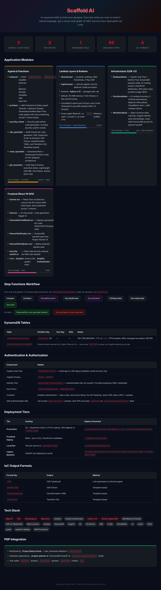
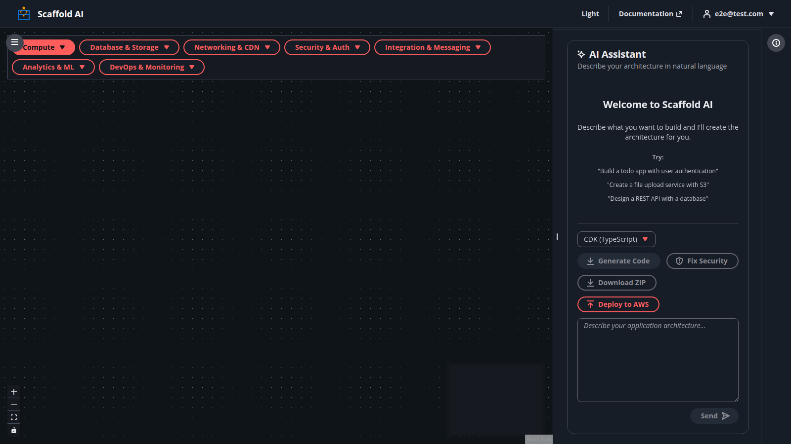
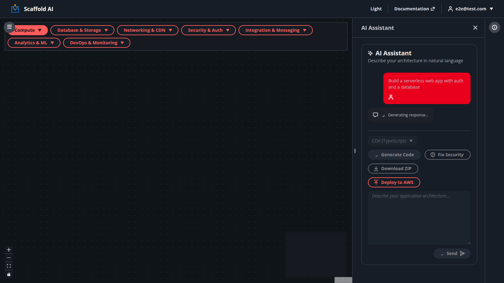
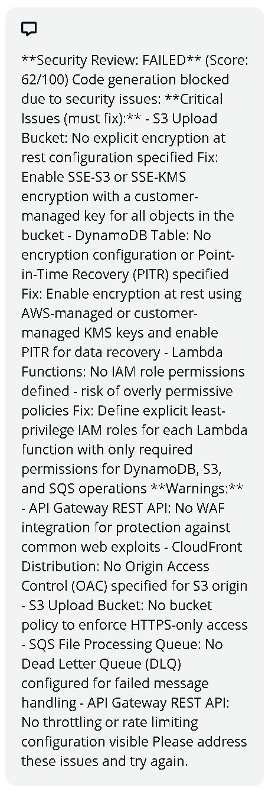
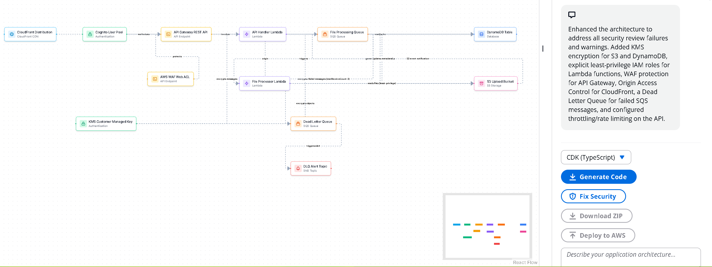
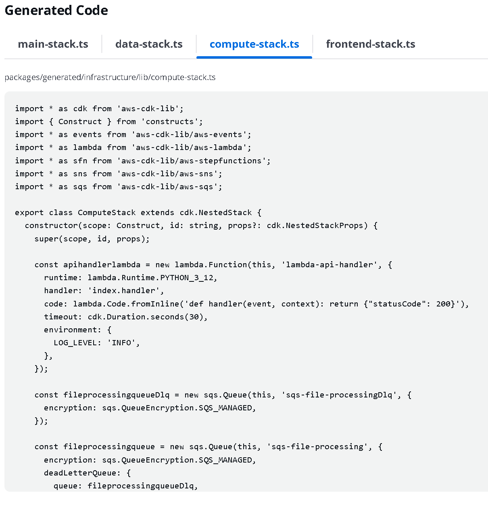
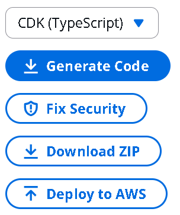

# Scaffold AI

**AI-powered AWS architecture designer — Step Functions + Strands agent core**

[](https://github.com/jfowler-cloud/scaffold-ai/actions)
[](https://opensource.org/licenses/MIT)
[](https://www.python.org/downloads/)
[](https://www.typescriptlang.org/)


Describe your application in natural language and Scaffold AI designs the AWS serverless architecture, runs a security review against AWS Well-Architected principles, and generates deployment-ready infrastructure-as-code -- all through a visual canvas and chat interface.

## Architecture Overview

See the interactive [Architecture Overview](docs/architecture.html) for a visual summary of agents, functions, infrastructure, and data flow.



## Why This Project

After building [Resume Tailor AI](https://github.com/jfowler-cloud/resume-tailor-ai) with AWS Step Functions, I wanted to explore modern AI orchestration. I originally built this with LangGraph, then refactored to Step Functions + Strands to align the entire portfolio on a consistent, AWS-native agent pattern.

The goal was to demonstrate:

- **Learning velocity** -- Shipping production-quality code in unfamiliar frameworks, fast
- **Architectural judgment** -- Knowing when to refactor and why, not just when to build
- **Production mindset** -- Security gates, rate limiting, input validation, and testing from the start, not bolted on later

| | Resume Tailor AI | Project Planner AI | Scaffold AI | Career Path Architect |
|---|---|---|---|---|
| **Purpose** | Resume optimization | Project planning | AWS architecture design | Career planning |
| **Orchestration** | AWS Step Functions | AWS Step Functions | AWS Step Functions | LangGraph |
| **Agents** | Step Functions workflow | SFN Map + Strands | 5 SFN Lambda + Strands | 6 LangGraph agents |
| **Tests** | 212 tests, 98% | 109 tests, 92% | 411 tests, 95% | 142 tests, 99% |
| **Features** | Resume tailoring | Architecture planning | Architecture generation | Roadmap + Critical Review |

All projects share the same production patterns (validation, error handling, pre-commit hooks, CI/CD, rate limiting, testing).

---

## Screenshots

| Blank canvas | Architecture generated from prompt |
|:---:|:---:|
|  |  |

| Security review (failed -- score 62/100) | Architecture updated with security fixes |
|:---:|:---:|
|  |  |

| Generated CDK code | Export and deploy options |
|:---:|:---:|
|  |  |

---

## How It Works

```
User Input --> Interpreter --> Architect --> Security Specialist --> Code Generator
                  |               |                |                      |
            Intent class    Graph nodes     Security score         CDK / Terraform / CF
```

- **Interpreter Agent** -- Classifies user intent (new feature, modify, explain, deploy)
- **Architect Agent** -- Designs AWS serverless architecture with 65+ AWS service node types
- **Security Specialist** -- Validates against AWS Well-Architected principles; blocks insecure designs (score < 70/100)
- **Code Generators** -- Multi-format IaC output (CDK TypeScript, CDK Python, CloudFormation, Terraform)
- **React Specialist** -- Generates AWS Cloudscape UI components

---

## Key Features

- **Visual Canvas** -- React Flow node graph editor with drag-and-drop AWS service nodes
- **AI Chat** -- Natural language architecture design powered by AWS Bedrock (Claude)
- **Security Gate** -- Automated scoring blocks code generation for insecure architectures
- **Security Badges** -- Visual indicators on each node showing active security configs (encryption, WAF, auth)
- **Security Auto-Fix** -- One-click security remediation with fail banner (Auto-Fix / Mark Resolved)
- **Multi-Format IaC** -- Generate CDK TypeScript, CDK Python, CloudFormation, or Terraform
- **Code Viewer** -- Tabbed modal for browsing generated infrastructure code
- **Export & Deploy** -- Download as ZIP or deploy directly to AWS with CDK
- **Project Planner Integration** -- Structured API integration with session-based storage
- **Shared Types Package** -- Type-safe data transfer with Project Planner AI
- **Rate Limiting** -- 10 req/min chat, 3 req/hr deployment, 20 req/min plan import
- **Dark/Light Mode** -- Toggle with localStorage persistence, CSS custom properties (`--sa-*`), Cloudscape Mode switching
- **Chat Session Sidebar** -- Session list with rename, delete, resume; auto-creates sessions on first message
- **Markdown Chat** -- `react-markdown` + `remark-gfm` for rich assistant messages (tables, code blocks, lists)
- **Toast Notifications** -- Flashbar-based auto-dismiss toasts via AuthContext
- **Keyboard Shortcuts** -- Ctrl+K focus chat input, Escape close modals
- **Empty States** -- Friendly empty states for chat and session sidebar
- **Responsive Layout** -- Media queries stack columns on mobile, hide chat sidebar on small screens
- **Pre-commit Hooks** -- TruffleHog secrets detection, AWS credentials scanning

### Integration with Project Planner AI

Scaffold AI receives project plans from [Project Planner AI](https://github.com/jfowler-cloud/project-planner-ai) via structured API:

- **DynamoDB handoff** - Planner writes plan data to `project-planner-handoff` table, Scaffold reads via URL params
- **Session-based storage** - Plans stored with unique session IDs and 24h TTL
- **Cognito-authenticated** - Both Planner (write) and Scaffold (read) use IAM-authenticated DynamoDB access
- **Graceful fallback** - Falls back to clipboard-based import if DynamoDB is unavailable
- **Auto-populated chat** - Project context pre-filled from plan data
- **7 comprehensive tests** - Full test coverage for import functionality

The integration enables a seamless workflow: Plan → Build → Deploy.

---

## Tech Stack

| Layer | Technology |
|-------|-----------|
| AI Orchestration | AWS Step Functions + Strands |
| LLM | AWS Bedrock (Claude) |
| Backend | AWS Lambda (Python 3.13+) + Step Functions |
| Frontend | React 19 + Vite SPA |
| UI Library | AWS Cloudscape Design System |
| State | Zustand |
| Canvas | React Flow |
| Testing | pytest + Vitest |
| Tooling | pnpm + Turborepo + uv |

### AI Models by Deployment Tier

| Tier | Model | Use Case |
|------|-------|----------|
| `testing` (default) | Claude Haiku 4.5 | Fast, cost-effective — local dev and CI |
| `optimized` | Claude Sonnet 4.5 | Balanced quality and cost |
| `premium` | Claude Opus 4.5 | Highest quality for production |

Set `DEPLOYMENT_TIER` in your `.env` to switch tiers. Override any tier with `BEDROCK_MODEL_ID`.

---

## Quick Start

### Prerequisites

- Python 3.13+
- Node.js 22+
- pnpm 10+
- AWS CLI configured with Bedrock access
- [uv](https://docs.astral.sh/uv/) (Python package manager)

### Installation

```bash
# Clone repository
git clone https://github.com/jfowler-cloud/scaffold-ai.git
cd scaffold-ai

# Install frontend dependencies
pnpm install

# Backend setup
cd apps/backend
uv sync
cp .env.example .env
# Edit .env with your AWS credentials
```

### Running Locally

```bash
# Frontend (port 3000)
cd apps/web
pnpm dev
```

> **Note:** The `apps/backend/` FastAPI server is for local development only. In production, Scaffold AI uses AWS Lambda functions invoked via Step Functions. The frontend calls AWS services directly via Cognito identity pool credentials.

### Environment Variables

**Backend** (`apps/backend/.env`):
```bash
AWS_REGION=us-east-1
# Prefer AWS_PROFILE or IAM role-based auth (recommended)
AWS_PROFILE=your_profile
# Raw keys work but are not recommended — use profile or IAM role instead
# AWS_ACCESS_KEY_ID=your_access_key
# AWS_SECRET_ACCESS_KEY=your_secret_key
BACKEND_URL=http://localhost:8001
PORT=8001

# Deployment tier (testing/optimized/premium) — default: testing
DEPLOYMENT_TIER=testing
# Model override — leave blank to use tier default
BEDROCK_MODEL_ID=
```

**Frontend** (`apps/web/.env`):
```bash
VITE_BACKEND_URL=http://localhost:8001
```

---

## Project Structure

```
scaffold-ai/
├── apps/
│   ├── backend/                # FastAPI — fire-and-poll API
│   │   ├── src/scaffold_ai/
│   │   │   ├── main.py         # FastAPI app (/api/chat starts SFN, /api/chat/{arn}/status polls)
│   │   │   ├── agents/         # Specialist agents (CDK, React, security, etc.)
│   │   │   ├── services/       # Business services (cost estimator, security autofix, etc.)
│   │   │   └── tools/          # Git, CDK synthesis
│   │   └── tests/
│   │
│   ├── functions/              # Lambda handlers — one per Step Functions state
│   │   ├── interpret/          # Classify user intent
│   │   ├── architect/          # Design/modify architecture graph
│   │   ├── security_review/    # Security gate (blocks code gen if failed)
│   │   ├── cdk_specialist/     # Generate IaC (CDK/CF/TF/Python-CDK)
│   │   ├── react_specialist/   # Generate React component scaffolding
│   │   └── get_execution/      # Poll SFN execution status
│   │
│   ├── agents/
│   │   └── shared/             # config.py, db.py — shared across functions
│   │
│   ├── infra/                  # CDK infrastructure
│   │   ├── lib/workflow-stack.ts  # Step Functions + alarms + budget
│   │   └── test/               # Snapshot + assertion tests (15 tests)
│   │
│   └── web/                    # React 19 + Vite SPA
│       ├── src/                # App entry point and root component
│       ├── src/test/           # e2e-main.tsx, e2e-auth-stub.ts
│       ├── e2e/                # Playwright E2E + accessibility specs
│       ├── components/         # Cloudscape components, Canvas, Chat
│       └── lib/                # Zustand stores
│
├── packages/
│   ├── generated/              # IaC output
│   └── ui/                     # Shared components
│
└── docs/
    └── steering/               # Cloudscape UI patterns
```

---

## Testing

```bash
# Backend tests
cd apps/backend
uv run pytest -v

# Frontend tests
cd apps/web
pnpm test

# All tests (from root)
pnpm test:all
```

Tests cover agents, services, Lambda handlers, API endpoints, input validation, rate limiting, and frontend components/stores.

---

## Portfolio Comparison

| | Resume Tailor AI | Scaffold AI | Career Path Architect |
|---|---|---|---|
| **Orchestration** | AWS Step Functions | AWS Step Functions | LangGraph |
| **Use case** | Deterministic resume tailoring | Dynamic AI multi-agent conversations | Career planning & roadmaps |
| **State management** | S3 + DynamoDB | Step Functions + DynamoDB | LangGraph built-in memory |
| **Deployment** | AWS-native (Lambda, Step Functions) | AWS-native (Lambda, Step Functions) | Framework-agnostic |

All three projects share production patterns: input validation, error handling, pre-commit hooks, CI/CD with security scanning, rate limiting, and comprehensive testing.

---

## Documentation

- [Development Journey](DEVELOPMENT_JOURNEY.md) -- Build timeline and key decisions
- [Multi-Format IaC](docs/MULTI_FORMAT_IAC.md) -- IaC generation patterns
- [Contributing](CONTRIBUTING.md) -- Development setup and guidelines
- [Testing Summary](TESTING_SUMMARY.md) -- Test coverage and strategy
- [Security Audit](SECURITY_AUDIT.md) -- Security review and improvements
- [Critical Review](CRITICAL_REVIEW.md) -- Self-assessment and roadmap

---

## Critical Review & Recommendations

Honest assessment of the codebase as of Feb 2026, based on a full source review. See also [CRITICAL_REVIEW.md](CRITICAL_REVIEW.md) for the detailed 44-item audit.

### ~~P0 -- Planner Import Loses Structured Data~~ (RESOLVED)

`usePlannerImport.ts` now supports two import modes: (1) session-based API (`/api/import/plan/{sessionId}`) which returns fully structured data, and (2) legacy `?prompt=` fallback with `parsePrompt()` that extracts project name, architecture, tech stack, and requirements from the formatted prompt text. Chat auto-submit now builds a rich prompt including all structured fields, review findings, and review summary.

### P0 -- No Authentication or Persistence

All endpoints are public. All state (architectures, chat history, sharing links, security scores) is stored in memory and lost on restart. The deploy endpoint runs `cdk deploy` with full system access and no user validation.

**Recommendation (short-term):** Add API key validation middleware for the deploy endpoint. Add a `projects` dict keyed by session ID so architectures survive page refreshes. **Recommendation (medium-term):** Add Cognito auth + DynamoDB persistence as outlined in CRITICAL_REVIEW.md Phase 1.

### P1 -- Deployment Service Runs Unsandboxed Subprocesses

`cdk_deployment.py` executes `npm install` and `npx cdk deploy` via `subprocess.run` with no container isolation, no disk space checks, and no cleanup on failure. A malicious or buggy CDK template could write anywhere on the filesystem.

**Recommendation:** Run CDK synthesis and deployment inside a Docker container with a read-only root filesystem and a tmpfs work directory. Add explicit timeouts and cleanup logic in `finally` blocks.

### P1 -- Broad Exception Handling Masks Root Causes

15+ `except Exception as e` blocks across the codebase catch everything and return generic "An internal error occurred" messages. This makes debugging difficult and hides transient vs. permanent failures.

**Recommendation:** Create a custom exception hierarchy (`ScaffoldError`, `LLMError`, `DeploymentError`, etc.). Catch specific exceptions, log with request context, and return structured error responses with error codes.

### P1 -- No Input Length Validation on Chat

~~`user_input: str` has no max length constraint.~~ **Correction:** `ChatRequest` does validate `user_input` with a 5000-char limit and non-empty check via `field_validator`. However, `graph_json: dict | None` is still unvalidated -- there is no schema check, no node count limit, and no max depth. A crafted graph payload could cause the architect prompt to exceed the LLM context window or produce excessive token costs.

**Recommendation:** Add a Pydantic validator for `graph_json` that rejects graphs with more than 50 nodes. Validate that node IDs and types match expected formats.

### ~~P2 -- Inconsistent Backend URL Configuration~~ (RESOLVED)

All frontend files now import `BACKEND_URL` / `PLANNER_URL` from `lib/config.ts`. The stale `NEXT_PUBLIC_*` env var references have been removed.

### ~~P2 -- Agent Classes vs. Node Functions Are Redundant~~ (RESOLVED)

Removed unused `InterpreterAgent` and `ArchitectAgent` classes. The files now contain only their system prompt constants, which are referenced by the Lambda handlers in `apps/functions/`. The `__init__.py` comment has been updated accordingly.

### P1 -- Deploy Endpoint Accepts Arbitrary CDK Code

The `/api/deploy` endpoint accepts raw `cdk_code` and `app_code` strings from the client and writes them to disk before executing `cdk deploy`. While `stack_name` is validated against a regex to prevent command injection, the **code content itself** is not inspected. An attacker could submit CDK code containing `child_process.exec()` or filesystem operations. The deployment runs with the server's full AWS credentials.

**Recommendation:** At minimum, validate that the CDK code only imports from `aws-cdk-lib` and `constructs`. Better: run synthesis in a Docker container with restricted network access and no AWS credentials, then deploy the synthesized CloudFormation template directly.

### ~~P2 -- PlannerNotification Shows Broken Content~~ (RESOLVED)

`PlannerNotification.tsx` now conditionally renders architecture and tech stack using `·` separators, and shows review findings count with critical/high breakdown. No more dangling punctuation from empty fields.

### ~~P2 -- Mixed Direct/Proxy Backend Calls in Frontend~~ (RESOLVED)

All backend calls in `Chat.tsx` now use `BACKEND_URL` from `lib/config.ts`. The chat flow uses a shared `sendChatRequest()` helper with fire-and-poll (matching the Step Functions backend), and all other calls (security autofix, deploy) also use `BACKEND_URL` consistently.

### P2 -- Generated File Disk Write Uses Fragile Path Resolution

`_write_generated_file` in `nodes.py` walks up 8 parent directories looking for `package.json` to find the repo root. If the backend is run from an unexpected working directory or the file structure changes, generated files may be written to the wrong location or silently fail.

**Recommendation:** Resolve the repo root once at startup via an environment variable or by walking from `__file__` with a known anchor (e.g., `apps/backend`). Cache the result instead of re-walking on every write.

### Integration with Project Planner AI

The planner-to-scaffold handoff works end-to-end via DynamoDB:
1. **DynamoDB handoff** (primary): Planner writes plan data to `project-planner-handoff` DynamoDB table via Cognito credentials, opens Scaffold AI with `?from=planner&session=...`. Scaffold reads full structured data including review findings.
2. **Clipboard fallback**: If DynamoDB write fails, plan description is copied to clipboard for manual paste.

Chat auto-submit builds a rich prompt with project name, architecture, tech stack, requirements, and review findings. The notification banner displays all available context.

---

## Contributing

Contributions welcome! See [CONTRIBUTING.md](CONTRIBUTING.md) for guidelines.

1. Fork the repository
2. Create a feature branch: `git checkout -b feature/amazing-feature`
3. Make changes and add tests
4. Run tests: `pnpm test:all`
5. Commit: `git commit -m 'feat: add amazing feature'`
6. Push and open a Pull Request

---

## Recent Updates

### v2.1.0 - Planner Integration & Fire-and-Poll Frontend (Mar 2026)
- Frontend Chat now uses fire-and-poll pattern matching the Step Functions backend (`sendChatRequest` + `pollExecution`)
- Planner auto-submit builds rich prompt with structured fields (project name, architecture, tech stack, requirements, review findings)
- `PlannerNotification` displays tech stack, review findings count with critical/high breakdown, no dangling punctuation
- Removed unused `InterpreterAgent` and `ArchitectAgent` classes (kept system prompt constants for Lambda handlers)
- Updated `__init__.py` and `CLAUDE.md` to reflect Step Functions architecture
- 5 new tests (structured planner data, review findings, workflow failure, non-ok start, fire-and-poll cycle)
- 411 tests passing across all suites (121 backend, 12 functions, 10 agents, 253 frontend, 15 CDK)

### v2.0.0 - Step Functions + Strands Refactor (Mar 2026)

> **Looking for the LangGraph version?** The previous LangGraph-based orchestration is preserved on the [`legacy/langgraph`](https://github.com/jfowler-cloud/scaffold-ai/tree/legacy/langgraph) branch.

- 🔄 Replaced LangGraph with AWS Step Functions + Strands agent core
- 🔄 Each workflow node is now an independent Lambda handler in `apps/functions/`
- 🔄 `/api/chat` is now fire-and-poll — returns `execution_arn` immediately, poll `/api/chat/{arn}/status`
- ✨ Added `apps/infra/` CDK stack defining the Step Functions state machine
- ✨ Added `apps/agents/shared/` config + db helpers (consistent with PSP/idea-fairy pattern)
- ✨ CloudWatch alarms (Lambda error rate, P99 duration, SFN execution failures)
- ✨ AWS Budget alarm ($25/mo, 80% threshold) with SNS topic
- ✨ CDK cost tags (`Project`, `Environment`, `ManagedBy`) on all resources
- ✨ CDK snapshot + assertion tests (15 tests)
- ✨ Accessibility tests (`@axe-core/playwright`) with WCAG 2.0 AA checks
- ✨ E2E test stubs (`e2e-main.tsx`, `e2e-auth-stub.ts`)
- 📈 Coverage improved: 64% → 95% (frontend: 253 tests, thresholds ratcheted to 96/88/94/97)

### v1.6.0 - Polish & Hardening (Feb 2026)
- Removed duplicate `SecurityAutoFix` class stub from `security_autofix.py`
- Added `graph_json` node count validation to `ChatRequest` (max 50 nodes, consistent with `GraphRequest`)
- Fixed fragile repo root resolution in `_write_generated_file` — now uses `Path(__file__).parents[4]` with anchor validation instead of walking up 8 levels looking for `package.json`
- Cleaned up `agents/__init__.py` — removed unused `InterpreterAgent`/`ArchitectAgent` exports, added clarifying comment
- README: added Project Planner AI to comparison table, removed raw AWS key example, added `PORT` env var, removed rocket emoji from header

### v1.5.0 - Security Visualization & UX Improvements (Feb 2026)
- ✨ Added SecurityBadge component to all 11 node types — shows active security configs (encryption, WAF, auth, etc.)
- ✨ Security fix visualization — auto-fix normalizes node types for React Flow rendering
- ✨ Security review fail banner with Auto-Fix and Mark Resolved actions
- ✨ Deploy to AWS modal with "coming soon" notice and manual deployment instructions
- ✨ Centralized BACKEND_URL config (`lib/config.ts`) — single source of truth for backend URL
- ✨ Added `skip_security` flag to workflow state for bypassing security gate
- 🐛 Fixed all 11 node files — removed duplicate JSX bodies
- 🐛 Fixed security gate test assertions and added missing GraphState fields
- ✅ 126 tests passing (up from 116)

### v1.6.3 - Hydration Fix & Model Prefix (Feb 2026)
- Fixed React hydration mismatch on Cloudscape `SplitPanel` — `aria-valuenow` on the resize handle is computed from `window.width` (client-only), causing SSR/client tree mismatch; deferred `splitPanel` prop render until after mount
- Fixed all Bedrock model IDs to use `us.` cross-region inference profile prefix (e.g. `us.anthropic.claude-haiku-4-5-20251001-v1:0`) — bare IDs were rejected by Bedrock in the `us-east-1` region
- Updated coverage badge to 64% (measured with pytest-cov; added `pytest-cov` to dev dependencies)
- Removed `mounted` guard that was blocking full-page render for 4+ seconds on planner handoff
- Scoped global CSS transition to `.theme-transitioning` class only (was applying to every element on every paint)
- Fixed CORS default to include `localhost:3001` alongside `localhost:3000`
- Auto-submit planner import to chat immediately instead of just populating textarea

### v1.6.2 - CI Fix (Feb 2026)
- Fixed `test_security_gate_blocks_insecure_architecture` and `test_security_gate_passes_secure_architecture` — both were making real Bedrock calls in CI (no credentials); now properly mock `get_llm` with ordered side effects
- Fixed `optimized` tier model ID: `anthropic.claude-sonnet-4-5-20250929-v1:0` (was `20251001`)
- 121 backend tests passing

### v1.6.1 - Deployment Tier Model Selection (Feb 2026)
- ✨ Added `config.py` with `testing/optimized/premium` deployment tier system
- ✨ Testing tier: Claude Haiku 4.5 (default) — fast and cost-effective
- ✨ Optimized tier: Claude Sonnet 4.5 — balanced quality and cost
- ✨ Premium tier: Claude Opus 4.5 — highest quality
- 🔧 `DEPLOYMENT_TIER` env var controls model selection; `BEDROCK_MODEL_ID` overrides
- 📝 Added model tier table to README and `.env.example`

### v1.4.0 - AI Model Upgrade & Polish (Feb 2026)
- ✨ Upgraded to Claude Opus 4.5 with cross-region inference profile
- ✨ Added portfolio context and capability badges to README
- 🐛 Fixed hydration mismatch with loading state
- 🐛 Resolved jszip module not found error
- 📝 Polished README for public release
- 🔧 Made type check and security scan non-blocking in CI
- 📦 **Dependency Updates:**
  - @cloudscape-design/components and chat-components to latest
  - @eslint/js from 9.39.2 to 10.0.1
  - Bumped actions/checkout from 4 to 6, actions/setup-node from 4 to 6, actions/setup-python from 5 to 6

### v1.3.0 - Dark Mode & UX Enhancements (Feb 2026)
- ✨ Added dark mode toggle with enhanced CSS patterns
- ✨ Added Scaffold AI logo
- ✨ Added Download ZIP button for generated files
- ✨ Styled Select dropdowns for dark mode
- 🐛 Fixed canvas toolbar container in dark mode
- 🐛 Fixed Deploy button for CloudFormation with manual instructions
- 🐛 Used dynamic timestamps in sharing and history services
- 🔧 Added GitHub Actions CI workflow

### v1.2.0 - Security & Reliability (Feb 2026)
- ✨ Added rate limiting, request timeout, and security hardening
- ✨ Added security history tracking
- ✨ Added architecture sharing and collaboration
- ✨ Added multi-stack architecture support
- ✨ Added Python CDK support
- ✨ Added architecture templates library
- ✨ Added security auto-fix capabilities
- ✨ Added cost estimation feature
- 🔒 Critical security fixes and hardening
- 📝 Updated roadmap — 7/9 medium-term items complete

### v1.1.0 - Testing & Quality (Feb 2026)
- ✨ Added frontend unit test suite with Vitest
- ✨ Added SecuritySpecialistAgent unit tests (19 tests)
- ✨ Added configurable CORS and CDK CloudFront support
- ✨ Added security gate and multi-format IaC generation
- 🐛 Fixed CF/TF node type mismatch
- 🐛 Resolved all test failures — mock paths, key names, and missing labels
- 📝 Added comprehensive CLAUDE.md for AI assistant onboarding

### v1.0.0 - Initial Release (Feb 2026)
- 🎉 Serverless-first architecture with 65+ AWS service node types
- 🎉 Step Functions + Strands multi-agent workflow with security specialist
- 🎉 Interactive drag-and-drop architecture canvas
- 🎉 CloudFormation and Terraform IaC generation
- 🎉 Real-time AI chat for architecture guidance

---

## Known TODOs

- ~~**Chat markdown rendering**: Add `react-markdown` + `remark-gfm` to `Chat.tsx`~~ DONE

## UI Formatting Note

This project has chat markdown rendering with `react-markdown` + `remark-gfm`, CSS custom properties (`:root` dark/light color palette with `sa-` prefix), notification toasts (Flashbar with auto-dismiss), keyboard shortcuts (Ctrl+K focus chat, Esc close modals), empty state illustrations, responsive media queries, light mode Authenticator/TopNavigation polish, session sidebar styles, and smooth theme transitions. Chat session rename/delete and metric card hover effects from [recon-ai](https://github.com/jfowler-cloud/recon-ai) may be backported in a future pass.

## License

MIT License -- see [LICENSE](LICENSE) for details.

## Related Projects

- **[Project Planner AI](https://github.com/jfowler-cloud/project-planner-ai)** - AI-powered project planning — generates architecture plans that hand off directly to Scaffold AI
- **[Resume Tailor AI](https://github.com/jfowler-cloud/resume-tailor-ai)** - AI-powered resume optimization with Claude Opus 4.5 (3 days, 212 tests, 98% coverage)
- **[Career Path Architect](https://github.com/jfowler-cloud/career-path-architect)** - AI-powered career planning with LangGraph (2 hours, 142 tests, 99% coverage)

**Together, these projects form a complete AI-powered career development platform.**

---

## Author

**James Fowler**
- GitHub: [@jfowler-cloud](https://github.com/jfowler-cloud)
- LinkedIn: [James Fowler - AWS Cloud Architect & DevOps Professional](https://www.linkedin.com/in/james-fowler-aws-cloud-architect-dev-ops-professional/)
